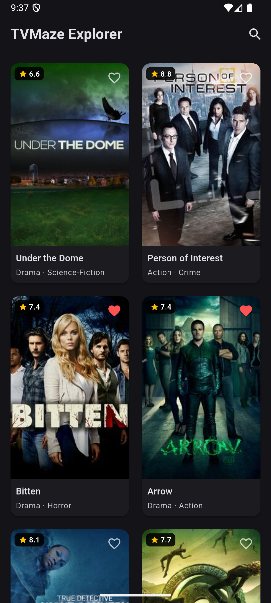
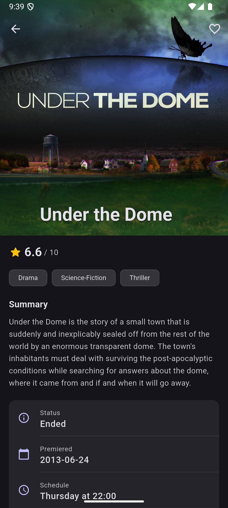

# TVMaze Explorer

A Flutter application for browsing and searching TV shows using the [TVMaze API](https://www.tvmaze.com/api).

## Download

📦 [Download APK](release/tvmaze-explorer.apk)

## Screenshots

<p align="center">
  
  &nbsp;&nbsp;
  
  &nbsp;&nbsp;
  
</p>

| Show List | Show Detail | Detail + Cast |
|:-:|:-:|:-:|
| Paginated grid with ratings & favorites | Hero poster, summary, genres | Info cards, network & cast |

## Setup & Run

```bash
# Install dependencies
flutter pub get

# Run the app
flutter run

# Run tests
flutter test

# Static analysis
flutter analyze
```

## State Management Choice: Riverpod

**Package:** `flutter_riverpod` v3.2.1

**Why Riverpod over Provider or Bloc:**

- Catches missing providers at compile time instead of crashing at runtime
- Supports `.select()` for efficient rebuilds — e.g., favoriting one show doesn't rebuild the entire grid
- Doesn't require `BuildContext`, keeping business logic clean from Flutter dependencies

**Architecture:**
- `NotifierProvider` for paginated show list and search state
- `FutureProvider.family` for detail screen data (auto-caches per show ID)
- `NotifierProvider` for favorites persistence (SharedPreferences-backed)

## Architecture

```
lib/
├── core/
│   ├── errors/          — Custom exception hierarchy
│   ├── network/         — Dio HTTP client configuration
│   ├── router/          — GoRouter route definitions
│   └── utils/           — HTML stripping, debouncer
├── features/shows/
│   ├── domain/
│   │   ├── models/      — Show, CastMember data models
│   │   └── repositories/ — Abstract repository interface
│   ├── data/            — API service, repository implementation
│   └── presentation/
│       ├── providers/   — Riverpod state management
│       ├── screens/     — ShowList, ShowDetail screens
│       └── widgets/     — ShowCard, CastCard components
└── main.dart
```

**Pattern:** Clean Architecture with repository pattern, separating UI → State → Domain → Data layers.

## Features

### Core
- ✅ Paginated show listing (250 shows/page, infinite scroll)
- ✅ Debounced search (500ms) with empty/error states
- ✅ Show detail screen with full info + HTML-stripped summary
- ✅ Proper loading, error, and empty states throughout
- ✅ Retry mechanisms on all error states

### Bonus
- ✅ **Favorites** — persist locally via SharedPreferences
- ✅ **Pagination** — infinite scroll on show listing
- ✅ **Cast Information** — embedded cast on detail page

## API Endpoints Used

| Endpoint | Purpose |
|---|---|
| `GET /shows?page={n}` | Paginated show listing |
| `GET /search/shows?q={query}` | Fuzzy search (multiple results) |
| `GET /shows/{id}?embed=cast` | Show detail with cast |

## Packages

| Package | Purpose |
|---|---|
| `flutter_riverpod` | State management |
| `dio` | HTTP client with interceptors |
| `go_router` | Declarative routing |
| `cached_network_image` | Image caching & placeholders |
| `shared_preferences` | Favorites persistence |
| `html` | Strip HTML from summaries |

## Assumptions

- TVMaze API is free and requires no API key
- Show index pagination starts at page 0 (250 results/page)
- Dark theme chosen as the default for modern look and feel

## Known Limitations

- No offline caching (shows require network connectivity)
- No filtering by genre/rating/status (not selected as bonus feature)
- Search results are not paginated (TVMaze search returns all matches at once)

## Time Spent

~3 hours
